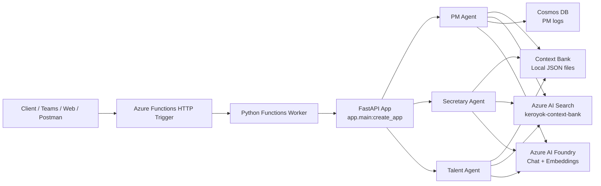

# Azure Functions Deployment Architecture

This document describes how Keroyok.AI Backend is deployed on Azure Functions using the Python v2 ASGI model.

## 1. High-level architecture



## 2. Request flow

1. A client sends an HTTP request to Azure Functions.
2. `function_app.py` wraps the FastAPI app with `AsgiFunctionApp`.
3. FastAPI handles routing for:
   - `/api/v1/pm/*`
   - `/api/v1/secretary/*`
   - `/api/v1/talent/*`
4. The selected agent executes business logic.
5. Data is persisted to:
   - local context bank JSON files
   - Azure AI Search for retrieval/vector search
   - Cosmos DB for PM audit logs
6. If Azure AI Foundry is unavailable, the app falls back to local deterministic runtime behavior.

## 3. Repository files involved

- `function_app.py` — Azure Functions entrypoint
- `host.json` — Functions host config (`routePrefix: ""`)
- `local.settings.example.json` — Local dev settings template
- `pyproject.toml` — Python dependencies, including `azure-functions`
- `app/main.py` — FastAPI app factory
- `app/core/config.py` — environment settings
- `app/core/dependencies.py` — service wiring and runtime selection

## 4. Required Azure settings

### Function runtime
- `FUNCTIONS_WORKER_RUNTIME=python`
- `AzureWebJobsStorage=<storage connection string>`
- `PYTHON_ISOLATE_WORKER_DEPENDENCIES=1`

### App settings
- `APP_ENV=production`
- `API_V1_PREFIX=/api/v1`
- `CONTEXT_BANK_DIR=/tmp/context_bank` (or another writable path)
- `USE_MICROSOFT_AGENT_FRAMEWORK=false` unless the runtime package is validated in the deployment environment

### Azure AI Foundry
- `AZURE_FOUNDRY_ENDPOINT`
- `AZURE_FOUNDRY_API_KEY`
- `AZURE_FOUNDRY_CHAT_DEPLOYMENT`
- `AZURE_FOUNDRY_EMBEDDING_DEPLOYMENT`

### Azure AI Search
- `AZURE_AI_SEARCH_ENDPOINT`
- `AZURE_AI_SEARCH_API_KEY`
- `AZURE_AI_SEARCH_INDEX_NAME=keroyok-context-bank`
- `AZURE_AI_SEARCH_VECTOR_DIMENSIONS=1536`

### Cosmos DB
- `COSMOS_ENDPOINT`
- `COSMOS_KEY`
- `COSMOS_DATABASE=keroyok-ai`
- `COSMOS_CONTEXT_CONTAINER=context-bank`
- `COSMOS_PM_LOG_CONTAINER=pm-agent-logs`

## 5. Deployment files

### `function_app.py`
The FastAPI app is wrapped as:

```python
import azure.functions as func
from app.main import app as fastapi_app

app = func.AsgiFunctionApp(app=fastapi_app, http_auth_level=func.AuthLevel.ANONYMOUS)
```

### `host.json`
The app disables the default `/api` prefix so FastAPI owns routing:

```json
{
  "version": "2.0",
  "extensions": {
    "http": {
      "routePrefix": ""
    }
  }
}
```

### `local.settings.example.json`
Use this as a template for local development. Copy it to `local.settings.json` and fill in values.

## 6. Local development flow

1. Copy `local.settings.example.json` → `local.settings.json`.
2. Set required values for local Azure Functions runtime.
3. Install dependencies.
4. Start the app with Azure Functions Core Tools.
5. Test routes locally via `/api/v1/...`.

## 7. Production deployment flow

1. Create an Azure Function App (Python 3.11).
2. Configure app settings in Azure Portal.
3. Ensure the storage account exists.
4. Publish using Azure Functions Core Tools or CI/CD.
5. Validate the root endpoint and each agent endpoint.

## 8. Operational notes

- Azure Functions works well for HTTP-triggered APIs and demos.
- For heavier AI workloads or longer LLM calls, Premium plan or a container-based host may be better.
- If Azure runtime packages are not available in the deployment environment, the app falls back to local deterministic behavior.
